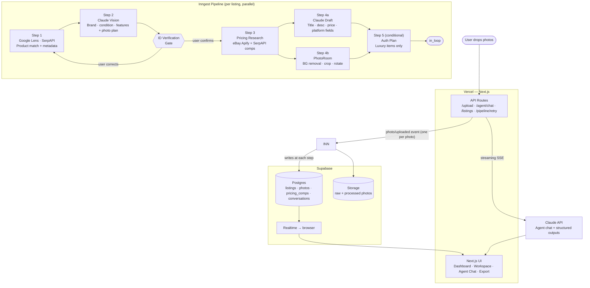
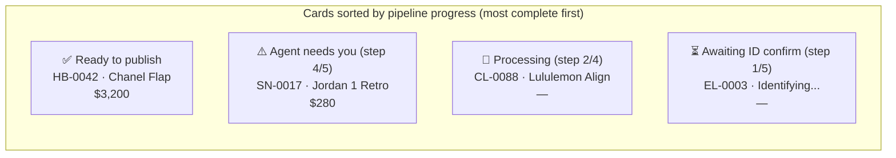

# AI Listings Platform — PRD

**Date:** 2026-04-22 | **Phase:** 1 | **Status:** Ready for implementation planning

---

## Goal

Automate the grunt work of resale listing creation. One photo per item → AI-driven pipeline → agent-assisted iteration → copy-paste to eBay/Poshmark. Designed for high volume (30–40 items in progress simultaneously). Agent is proactive; user attention is a scarce resource.

---

## Required Credentials

Gather these before starting implementation:

| Service | Credential | Notes |
| --- | --- | --- |
| **Anthropic** | `ANTHROPIC_API_KEY` | API billing account — separate from Claude Code subscription. Claude Code subscription cannot be used for app API calls. Sign up at `console.anthropic.com`. |
| **SerpAPI** | `SERPAPI_API_KEY` | For Google Lens (product ID) and cross-platform pricing. `serpapi.com` |
| **Apify** | `APIFY_TOKEN` | For eBay sold/completed listings MCP. `apify.com` |
| **eBay** | `EBAY_CLIENT_ID` + `EBAY_CLIENT_SECRET` | Developer account + app keys. Optionally `EBAY_USER_REFRESH_TOKEN` for higher rate limits. `developer.ebay.com` |
| **PhotoRoom** | `PHOTOROOM_API_KEY` | `photoroom.com/api` |
| **Supabase** | `SUPABASE_URL` + `SUPABASE_ANON_KEY` + `SUPABASE_SERVICE_ROLE_KEY` | Create a **dedicated project** — do not share with other Supabase projects. |
| **Inngest** | `INNGEST_SIGNING_KEY` + `INNGEST_EVENT_KEY` | `app.inngest.com` — account likely already exists, check for existing keys. |
| **Vercel** | Connected via GitHub | No separate key needed; env vars injected via Vercel dashboard. |

> **On Claude API access:** The Anthropic API requires API credits billed separately from any subscription. OpenAI credits also cannot substitute — Claude models are required for vision analysis, agent chat, and listing generation. Budget ~$0.15–$0.21 per item processed through the full pipeline.

---

## System Architecture



---

## Listing Lifecycle

```mermaid
stateDiagram-v2
    [*] --> Intake : Photo uploaded

    state Intake {
        [*] --> ProductID : SerpAPI / Google Lens
        ProductID --> VisionAnalysis : Claude Vision + photo plan
        VisionAnalysis --> IDGate : pause for user confirmation
        IDGate --> PricingResearch : confirmed ✓
        IDGate --> ProductID : corrections provided ↺

        state "Parallel" as Par {
            PricingResearch
            DraftListing
            ImageProcessing
        }

        PricingResearch --> Par
        DraftListing --> Par
        ImageProcessing --> Par
        Par --> AuthPlan : luxury brand?
        AuthPlan --> ReadyForLoop
    }

    Intake --> InLoop : Pipeline complete

    state InLoop {
        [*] --> AgentWorking
        AgentWorking : pricing · description · auth · photo review
        AgentWorking --> UserReview : agent surfaces findings or is blocked
        UserReview --> AgentWorking : iterate
    }

    InLoop --> Finalizing : User marks ready

    state Finalizing {
        SEOAudit --> ExportFields
    }

    Finalizing --> Published : Copied to platform
    Published --> InLoop : Re-opened
    Published --> Archived : Sold
```

---

## Intake Pipeline — Detail

### ID Verification Gate

After Step 2 (vision analysis), the pipeline **pauses** and surfaces a confirmation card in the UI before proceeding. This prevents downstream cost on a misidentified item.

The confirmation card shows:
- Identified product name + brand
- Category + detected variant (size, color, model number)
- Confidence level
- Extracted key attributes (e.g., "Medium, Black Caviar, Gold Hardware")

User responses:
- **"Looks right"** → pipeline continues to Step 3
- **"Fix it"** → free-text correction field; agent re-runs identification with the correction as additional context; gate re-appears

This is especially important for scale errors (Tokidoki 3" figure vs 12" statue), size variants (Chanel Small vs Medium Flap), and model confusion (Jordan 1 Mid vs High).

### Photo Quality Gate (studio photos only)

When studio photos are uploaded (not the intake photo), each image is evaluated for quality before hitting PhotoRoom:

Quality checks (Claude Vision, fast/cheap):
- Blur / motion blur
- Underexposure / overexposure
- Subject not centered or cropped off
- Multiple items in frame (for a single-item listing)

On failure: photo is flagged with the specific issue. User is notified via toast. Failed photos are not sent to PhotoRoom. User re-shoots and re-uploads.

### Per-step cost estimate

| Step | Service | Cost/item |
| --- | --- | --- |
| 1 | SerpAPI (Google Lens) | ~$0.01 |
| 2 | Claude Vision + photo plan (combined call) | ~$0.01–$0.02 |
| 3 | eBay Apify comps + SerpAPI cross-platform | ~$0.01–$0.03 |
| 4a | Claude draft (text-only) | ~$0.02–$0.03 |
| 4b | PhotoRoom | ~$0.08–$0.10 |
| 5 | Claude auth plan (luxury only) | ~$0.02 |
| **Total** | | **~$0.13–$0.21** |

---

## Data Model (updated)

### `listings` (key fields, deltas from design spec)

```typescript
{
  // IDs
  id: uuid
  sku: string                  // HB-0042

  // Status
  status: 'intake' | 'id_gate' | 'in_loop' | 'finalizing' | 'published' | 'archived'
  pipeline_step: number        // current step (1–5) for dashboard progress display
  pipeline_total: number       // total steps (5 for luxury, 4 for non-luxury)

  // Core fields
  title: string                // canonical
  description: string
  category: string
  brand: string
  condition: ConditionValue    // see Condition Values below
  condition_notes: string      // free-form: "scuff on bottom-left corner, consistent with normal use"
  tags: string[]               // user-applied tags for filtering/grouping
  inclusions: Inclusion[]      // [{ item, included, notes }]

  // Pricing
  suggested_price_cents: number
  final_price_cents: number
  confidence_score: number     // 0–100

  // Plans
  auth_plan: AuthStep[]        // [{ step, guidance, status, photo_required }]
  photo_plan: PhotoShot[]      // [{ shot, description, required, photo_type }]

  // Platform
  platform_fields: {
    ebay: { title: string, category_id: string, item_specifics: Record<string, string>, ... }
    poshmark: { title: string, category: string, size: string, ... }
  }
  listing_urls: {              // replaces separate ebay_listing_url, poshmark_listing_url fields
    ebay?: string
    poshmark?: string
    mercari?: string           // ready for Phase 2
    [platform: string]: string | undefined
  }

  // Agent
  agent_blocked: boolean
  agent_blocked_reason: string | null

  // Meta
  is_luxury: boolean
  intake_meta: object
  created_at: timestamptz
  updated_at: timestamptz
}
```

### Condition values + free-form notes

| Value | Display | eBay | Poshmark |
| --- | --- | --- | --- |
| `new_with_tags` | New with Tags | New | NWT |
| `new_without_tags` | New without Tags | New without tags | NWOT |
| `like_new` | Like New | Used — Like New | Excellent |
| `very_good` | Very Good | Used — Very Good | Good |
| `good` | Good | Used — Good | Good |
| `fair` | Fair | Used — Acceptable | Fair |
| `poor` | Poor | Used — For parts | Poor |
| `for_parts` | For Parts | For parts or not working | — |

`condition_notes` is a free-form field for item-specific detail. The agent populates an initial draft after photo review ("Minor scuffing on heel, visible crease across toe box") and the user refines it.

---

## Agent System

### System prompt directives

Encode these in `lib/agent/system-prompt.ts`:

```
You are the listing agent for an AI-powered resale platform.
You manage listings autonomously. You are proactive.

RULES:
- Do not ask for permission to continue routine work.
- Do not say "shall I proceed?" or "would you like me to..." for low-risk actions.
- Execute, then report what you did.
- Only interrupt the user when: (1) you need information you cannot infer,
  (2) photo quality has failed and re-shoot is needed, (3) identification
  needs confirmation, or (4) a decision has meaningfully different outcomes.
- There may be 30–40 listings in progress. Respect the user's attention.
- When you surface a question, make it specific and answerable in one sentence.
```

### Context assembly (cache-optimized)

```
[CACHE-STABLE PREFIX]
1. System prompt
2. skills/agent-skills.md (full file — all brands/categories)
3. Listing snapshot

[DYNAMIC SUFFIX]
4. Conversation history (sliding window, ≤ 8k tokens)
5. This turn's tool result (pre-aggregated, ≤ 300 tokens)
```

All skills loaded upfront → stable cache prefix → high hit rate across turns.

### Thick tools — structured outputs

Use Claude's structured output mode (tool use with strict JSON schema) for all agent tool returns. This enforces the TypeScript interfaces at the API layer, not just at the type-checker.

Key tool signatures (full interfaces in `docs/thick-tools-pattern.md`):

| Tool | Returns | ~tokens |
| --- | --- | --- |
| `research_pricing(listingId)` | `{ suggestedPrice, confidence, confidenceSummary, comps[5], evidence }` | ~200 |
| `get_auth_checklist(listingId)` | `{ steps[], platformAuth: { eligible, platform, threshold } }` | ~150 |
| `build_description(listingId)` | `{ canonical, platforms[{ platform, title, description }] }` | ~250 |
| `update_listing(listingId, fields)` | diff of changed fields | ~50 |
| `get_listing_summary(listingId)` | all fields + counts | ~300 |
| `get_photo_plan(listingId)` | shot list with status | ~100 |

Python runtime (mcp-exec v0.3): use for `research_pricing` when comp sets are large — pandas weighted median + outlier removal stays in sandbox.

---

## Agent Skills File

Location: `skills/agent-skills.md`

Single flat file. All sections always in context. Sections:

- Handbags (general) — auth signals, hardware, date codes, dust bags, strap
- Chanel — auth card serial → era lookup, hologram, quilting by year, CC logo
- Louis Vuitton — date code format, canvas grading, hardware
- Christian Louboutin — red sole condition (key value driver), Loubi code (post-2011), heel accuracy
- Gucci — serial number format, authenticity card, hardware, canvas/leather tells
- Sneakers (general) — DS vs worn, box label, toe box shape, creasing
- Nike / Jordan — legit-check by model, heel tab, insole tags, colorway verification
- Electronics (general) — functional test checklist, IMEI/serial, cosmetic grading, accessory completeness
- Clothing (general) — measurements, label check, wash wear grading
- Luxury (general fallback) — generic auth signals; for items ≥ $500 use eBay Authenticity Guarantee or Poshmark Posh Authenticate — no referrals to Entrupy or Real Authentication

---

## UI

### Dashboard



**Card anatomy:**

```
┌──────────────────────────────────┐
│ [photo]   HB-0042                │
│           Chanel Classic Flap    │
│           $3,200                 │
│           Step 4 of 5            │
│           [agent needs you 🔴]   │
└──────────────────────────────────┘
```

**Status badges** (one shown, most urgent first):

1. `⏳ Awaiting confirmation` — ID gate open
2. `🔴 Agent needs you` — blocked, has question
3. `⚠️ Step failed` — names which step
4. `📸 Needs auth photos`
5. `🔄 Processing — step N of M`
6. `✅ Ready to publish`

**Upload zone:** Full-width drag-and-drop at top of dashboard. Dropping N photos creates N listings instantly, each entering the pipeline. Animate cards appearing one by one as events fire. *(This drag-drop → cards-appearing flow is documentation/README video material.)*

### Listing Workspace

```
┌─────────────────────────────────────────────────────────────────────┐
│ HB-0042 · Chanel Classic Flap · Step 4 of 5                  [Edit] │
├───────────────────────────┬─────────────────────────────────────────┤
│ PHOTOS                    │ AGENT CHAT                              │
│ ┌──────────────────────┐  │                                         │
│ │   main photo (large) │  │  Agent: Found 8 comps. Median $3,340,   │
│ │                      │  │  adjusted to $3,200 for "good" vs        │
│ └──────────────────────┘  │  "like new". Confidence 87%.            │
│ [📷][📷][📷][📷]          │                                         │
│                           │  You: what's left on auth?              │
│ PHOTO PLAN  (3/8 done)    │                                         │
│ ☑ Front flat              │  ⚡ get_auth_checklist...               │
│ ☑ Back flat               │                                         │
│ ☐ Auth card               │  Agent: Still need auth card photo      │
│ ☐ Serial number           │  and hologram sticker (step 4, 5).      │
│ ...                       │  Serial should start 12–14 digits.      │
│                           │                                         │
│ INCLUSIONS                │  ─────────────────────────────────────  │
│ ☑ Dust bag                │  [Ask the agent anything...]    [Send]  │
│ ☑ Auth card               │                                         │
│ ☐ Original box            │                                         │
│                           │                                         │
│ FIELDS                    │                                         │
│ Title: [Chanel Classic...] │                                        │
│ Condition: [Good ▾]       │                                         │
│ Notes: [scuff on bottom...]│                                        │
│ Price: $3,200  87% conf   │                                         │
│         [view evidence]   │                                         │
└───────────────────────────┴─────────────────────────────────────────┘
```

### Publish Export

```
┌──────────────────────────────────────────────────────┐
│ Export — HB-0042                                     │
│ [eBay]  [Poshmark]                                   │
├──────────────────────────────────────────────────────┤
│ Title (80 chars)                            [Copy]   │
│ Chanel Classic Flap Medium Black Caviar GHW Auth     │
│                                                      │
│ Category                                    [Copy]   │
│ Handbags & Purses › Designer › Chanel                │
│                                                      │
│ Condition                                   [Copy]   │
│ Pre-Owned                                            │
│                                                      │
│ Price                                       [Copy]   │
│ $3,200.00                                            │
│                                                      │
│ Item Specifics                              [Copy]   │
│ Brand: Chanel · Style: Flap · Color: Black           │
│                                                      │
│ Description                                 [Copy]   │
│ [full description, scrollable]                       │
│                                                      │
│ [Copy All Fields]                                    │
│                                                      │
│ Listing URL (paste after publishing):                │
│ [________________________]  [Save]                   │
└──────────────────────────────────────────────────────┘
```

### Notifications (toasts)

Toast queue in bottom-right. Auto-dismiss after 5s unless action required.

| Trigger | Toast |
| --- | --- |
| Pipeline complete | "HB-0042 ready — tap to review" |
| ID gate opened | "HB-0042 needs ID confirmation" |
| Agent blocked | "HB-0042: agent has a question" |
| Step failed | "HB-0042: pricing research failed — retry?" |
| Photo quality failed | "3 photos flagged for quality — see HB-0042" |
| Export URL saved | "Listing URL saved for HB-0042" |

---

## Future Phases

### Phase 2

- eBay / Poshmark API sync via `ebay-mcp` — auto-publish from export fields
- Self-promotion automation using `listing_urls`
- Mercari as third platform (already in `listing_urls` schema)

### Phase 3 — Collectibles

- `CO` SKU prefix + `collectibles` category
- Tokidoki brand skill: wave/series ID, chase vs standard, collaboration variants, vinyl figure grading

### Phase 4 — Browser Automation

- Claude browser extension (or Playwright-based) for eBay listing creation and sync
- Ingest platform messages (buyer questions) and serve replies through the agent
- Platform promotion automation (promoted listings, watchers, offers)

---

## Open Questions

These must be resolved before implementation begins:

1. **Inngest account status** — Is there an existing Inngest account? If so, retrieve signing key and event key from `app.inngest.com`. Confirm which plan (free tier handles ~50k events/month).

2. **Apify eBay sold comps — pricing model** — Apify bills by compute unit. Estimate: 1 actor run per listing = ~$0.002–$0.005. Confirm by running a test search and checking the run cost in the Apify console.

3. **eBay Completed Listings API access** — The Browse API (free) returns active listings only. Completed/sold data requires Marketplace Insights API, which has access restrictions (may require approval or use a different endpoint). The Apify actor is the workaround — confirm it returns sold prices, not just active.

4. **PhotoRoom plan selection** — At what volume does the per-image cost become a concern? Check current pricing tiers at `photoroom.com/api/pricing` and select the right plan before go-live.

5. **Identification verification UX** — Should the ID gate show a "confidence threshold" (auto-approve if Claude confidence ≥ 95%, gate if lower)? Or always gate? Consider: auto-approval speeds things up but scale errors (small vs large item) may not always produce low confidence scores.

6. **Condition notes — agent auto-draft** — The agent proposes an initial `condition_notes` draft from studio photos. This requires a separate Claude vision call on the studio photos. Is this acceptable cost-wise (~$0.01–$0.02 per listing), or should it be triggered manually?

7. **Skills file editing** — `skills/agent-skills.md` is a plain file edited directly. Is a UI skill editor (markdown editor in the app) needed in Phase 1, or is file editing acceptable for now?

8. **Supabase Realtime at scale** — With 30–40 active listings each updating multiple times during pipeline processing, Realtime channel load may become significant. Confirm Supabase plan includes sufficient concurrent connections.

9. **eBay Authenticity Guarantee threshold** — Confirmed minimum for eBay GA is $500? Verify current threshold at `developer.ebay.com` — it may vary by category (handbags vs sneakers).

10. **SerpAPI plan** — Starter plan is ~$0.01/search. At scale (say 100 items/month × 3 searches each = 300 searches/month = $3). Negligible, but confirm the plan allows Google Lens engine calls specifically.
